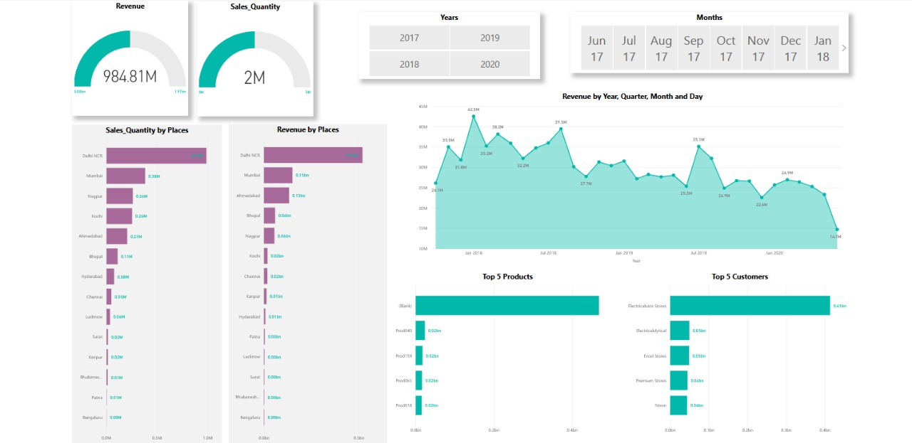

# ** Driving Strategic Sales Decisions with Power BI**

 <!-- Replace with the link to your dashboard preview image -->

## **Project Overview**

I'm pleased to share a recent project where I developed an advanced Power BI dashboard for a leading computer hardware company. This tool significantly enhanced their sales tracking capabilities, converting complex Excel reports into clear, actionable insights. The dashboard provides real-time visibility into revenue trends and regional performance, empowering leadership to make data-driven decisions that drive growth.

This project showcases the practical application of data analysis in a corporate environment, delivering tangible business value. Explore the published report for a closer look at how data visualization can transform decision-making. 🌐


### **✨ Key Features**

- **Custom Filters**: **🔍** Sort data effortlessly by city and room class.
- **Performance Tracking**: **📈** Monitor week-on-week changes in key metrics like Revenue, Occupancy %, and ADR.
- **Comparative Analysis**: **📊** Compare weekday vs. weekend performance for strategic insights.
- **Granular Insights**: **🔬** Delve into property-specific metrics and booking platform efficiency.

### **🔧 Dashboard Features**

- **City and Room Class Filtering**: Filter and focus on specific data segments.
- **Key Performance Indicators (KPIs)**: Prominently display critical KPIs.
- **Occupancy Visualization**: Visualize occupancy rates by category.
- **Trend Analysis**: Track trends for RevPAR, ADR, and Occupancy over time.
- **Detailed Property Metrics**: In-depth metrics for individual properties.
- **Booking Platform Analysis**: Evaluate the effectiveness of different booking platforms.


## **🛠️ Technologies Used**

- **Microsoft Excel**: For data preparation and initial analysis.
- **MySQL**: For robust data storage and retrieval.
- **Power BI**: For creating interactive and dynamic visualizations.

## **🚀 Getting Started**

1. **Clone the Repository:**
   ```bash
   git clone https://github.com/Kunal10411/ Driving Strategic Sales Decisions with Power BI.git
